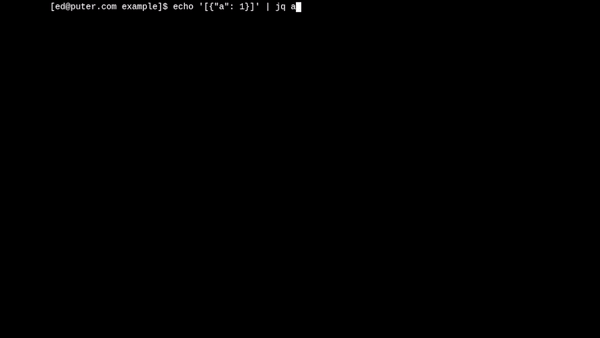

<h2 align="center">Aethera</h2>
<h3 align="center">RedOS's web-mode shell</h3>
<h3 align="center"></h3>
<hr>

`aethera` is a web-based shell built for [redOS](https://anura.pro).
Forked and modified from 
[HeyPuter/puter (packages/phoenix)](https://github.com/HeyPuter/puter/tree/main/packages/phoenix),
where more information on the original project can be found.
Support for platforms other than redOS will be gutted from this fork, as this
is intended to be a heavily integrated with redOS in specific.

## Running Aethera

### In redOS

Documentation on how to run Aethera in redOS is coming soon.

## Testing

You can find our tests in the [test/](./test) directory.
Testing is done with [mocha](https://www.npmjs.com/package/mocha).
Make sure it's installed, then run:

```sh
npm test
```

## What's on the Roadmap?

We're looking to continue improving the shell and broaden its usefulness.
Here are a few ideas we have for the future:

- local machine platform support
  > See [this issue](https://github.com/HeyPuter/phoenix/issues/14)
- further support for the POSIX Command Language
  > Check our list of [missing features](doc/missing-posix.md)

